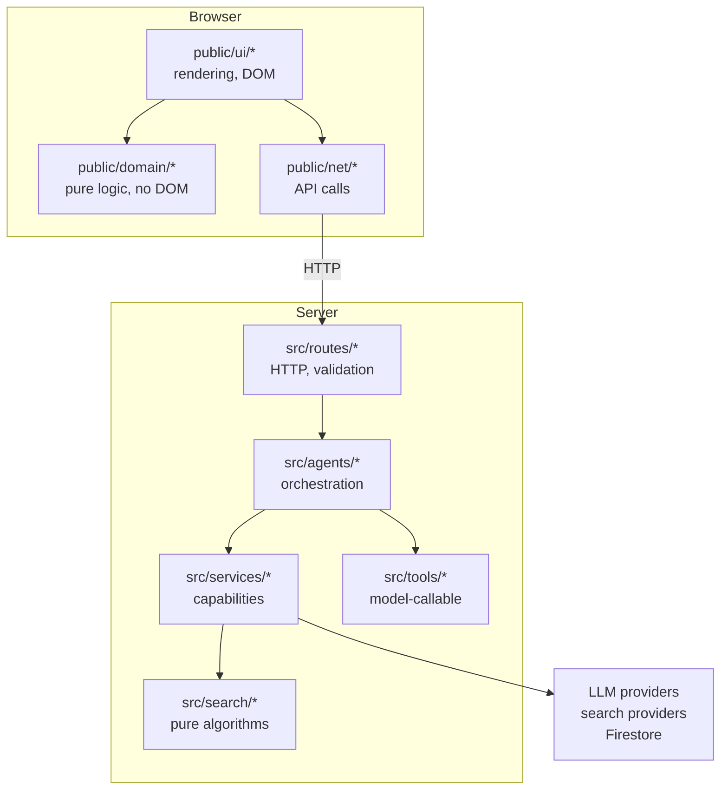

# Architecture

The target shape of this codebase, why it is that shape, and what is not
done yet. Written to be read before changing anything structural.

## Where it stands

Measured, not estimated:

| Area | State |
|---|---|
| `src/` backend | Service-oriented, no file over 1,111 lines. Healthy. |
| `public/app.js` | 6,760 lines, 240 top-level functions, one IIFE. The problem. |
| Worst function | `sendMessage`, 588 lines, cyclomatic complexity 126 |
| Tests | 236 browser assertions, 252 server assertions, all in CI |
| Build step | None, deliberately |

The backend does not need restructuring. Adding Clean Architecture
ceremony to a 776-line `server.js` would add layers without removing any
problem. The frontend is where the cost is, so that is where the work
goes.

## Layers



The rule that matters: **dependencies point inward and downward**. `domain`
never imports from `ui`. `search/searchCore` never imports a service. A
module that has no dependency on the DOM or the network is a module that
can be unit tested in milliseconds, and most bugs live in exactly that
kind of code.

## Directory layout

```
qjo-ai/
├── server.js                    Composition root: reads env, builds
│                                dependencies, injects them into routes.
│                                The only file that knows about process.env.
├── src/
│   ├── routes/                  HTTP boundary. Parse, validate, delegate,
│   │   ├── chat.js              serialise. No business logic.
│   │   ├── sse.js               Stream headers, keep-alives, cached replies
│   │   └── tasks.js
│   ├── agents/                  Orchestration: what to call, in what order,
│   │   ├── RoutingEngine.js     what to do when it fails.
│   │   ├── toolLoop.js          Tool rounds against the deadline; always ends in an answer
│   │   ├── toolAnswer.js        Evidence as data, synthesis prompt, sources-only fallback
│   │   ├── TaskRunner.js
│   │   └── taskStore.js         Storage port (Firestore | memory adapter)
│   ├── services/                One capability each, provider-facing.
│   │   ├── llmService.js        Providers, keys, rotation, cooldowns
│   │   ├── providerResponse.js  Reading a 200 body: SSE or JSON, under a timer
│   │   ├── searchService.js     Search providers, enrichment
│   │   ├── exportService.js     PDF/DOCX/PPTX rendering
│   │   └── textSanitizer.js
│   ├── tools/                   Model-callable capabilities. Schema and
│   │   ├── toolRegistry.js      implementation declared together.
│   │   ├── searchTool.js
│   │   ├── fetchPageTool.js
│   │   └── workspaceTools.js
│   └── search/
│       ├── providers.js         Tavily, Serper, key-free fallbacks, per-provider health
│       └── searchCore.js        Pure: ranking, query distillation, scoring
├── public/
│   ├── index.html
│   ├── app.js                   Shell: state and wiring. Shrinking.
│   ├── lang-boot.js             Sets lang/dir before first paint
│   ├── domain/                  Pure functions. No DOM, no fetch, no state.
│   │   ├── language.js          Which language a text is in; which one the page opens in
│   │   ├── i18n.js              Every interface string, English and Arabic, same keys
│   │   ├── markdown.js
│   │   ├── requestFailure.js    Error in, message and retry decision out
│   │   └── streamProtocol.js    SSE parsing, think-tag split, stall watchdog
│   ├── ui/                      Rendering and DOM behaviour
│   └── net/                     API calls
├── scripts/                     Tests and checks, all runnable via npm
└── docs/
```

### Where new code goes

| Kind of code | Location | Test |
|---|---|---|
| Pure calculation, formatting, parsing | `public/domain/` or `src/search/` | Unit, no browser |
| Anything touching the DOM | `public/ui/` | Browser suite |
| An HTTP call | `public/net/` | Browser suite with routing |
| A capability the model can call | `src/tools/` | `scripts/test-*.js` |
| Provider integration | `src/services/` | Stubbed provider |
| Reading `process.env` | `server.js` only | — |

## Dependency injection

There is no container and there does not need to be one. Every module that
needs a collaborator takes it as an argument:

```js
const routingEngine = createRoutingEngine({ llmService, searchService, keys, models, extraTools });
const taskRunner = createTaskRunner({ store, llmService, searchService, keys, models });
registerChatRoutes(app, { verifyFirebaseRequest, routingEngine, cacheGet, cacheSet });
```

`server.js` is the only composition root. This is why the test suites can
run the real `RoutingEngine` against a scripted provider without a network,
and why `taskStore` swaps Firestore for memory by configuration rather than
by a flag inside the code.

`requireDeps()` at the top of each factory fails loudly at boot when a
dependency is missing, rather than at 3am inside a request handler.

## Quality gates

All wired into CI; all runnable locally.

| Command | What it holds |
|---|---|
| `npm run structure` | Per-file line budgets. A watched file may shrink, never grow. |
| `npm run typecheck` | JSDoc types checked by the TypeScript compiler. No build output. |
| `npm run lint` | Complexity ≤30, depth ≤5, params ≤6, plus correctness rules |
| `npm test` | Server behaviour, 34 assertions |
| `npm run test:search` | Search decision, results, budget |
| `npm run test:agent` | Tool loop bounds |
| `npm run test:tasks` | Task durability across restarts |
| `npm run test:fetch` | SSRF guards |
| `npm run test:resilience` | Key cooldowns, context recovery, trim budgets |
| `npm run test:stream` | Streaming integrity |
| `npm run test:routing` | Request classification |
| `npm run test:pdf` | Export rendering |
| `npm run scan-secrets` | No credentials in tracked files |

The structure and complexity budgets are ratchets set at what the code did
on the day they were added. Thresholds that fail immediately get disabled;
thresholds that start where you are get tightened.

## Security boundaries

| Surface | Protection |
|---|---|
| `fetch_page` opens model-chosen URLs | http/https only; private, loopback and link-local refused including `169.254.169.254`; DNS resolved and every resolved address checked; redirects followed manually with each hop re-validated; response streamed under a cap |
| Workspace file paths come from the model | Absolute paths, drive paths and traversal are validation errors; the workspace is an object in task state, never the filesystem |
| User JavaScript execution | Web Worker from a `blob:` URL, off the main thread |
| Answer HTML | Escaped before insertion; markdown rendering never emits raw user HTML |
| Provider keys | `server.js` only, never sent to the client; `scan-secrets` blocks commits |
| Task access | Every task route checks the caller owns the task |

## Languages

English is the primary language; Arabic is first-class.

- The page opens in the saved choice, else Arabic if the browser's first
  preference is Arabic, else English (`public/domain/language.js`). The
  direction is set before first paint by `lang-boot.js`.
- Every interface string lives in `public/domain/i18n.js` in both languages.
  The domain suite fails if the two catalogs differ in keys or placeholders,
  if English text contains Arabic, or if Arabic text was left in English.
- What the page answers itself, and what it sends the model, follows the
  language of the person's message, not the interface.
- The server prompt is English-first; the Arabic craft (`arabicPrompt.js`) is
  added whenever Arabic is in play. `scripts/test-language.js` requires every
  Arabic phrase the prompt ever carried to still reach the model.
- The older browser suites run in an Arabic browser, keeping the Arabic
  interface under test; `language.test.js` covers English as primary.

## Failure handling

Each of these exists because it happened.

| Failure | Behaviour |
|---|---|
| Provider returns an empty answer | Treated as that provider failing; chain moves on |
| Prompt exceeds the context window | Halved keeping both ends, retried, model told content was removed |
| Context-length rejection | Not a key fault: no cooldown, no rotation |
| Search provider unreachable | Raced against a budget; snippets beat perfect results nobody receives |
| Search provider rejects the request (400/422) | Retried once with only the minimal documented parameters |
| Search provider out of credits or key rejected | Logged once a minute, rests 10 min (quota) or 30 min (key) instead of being asked every query; reason visible in `/api/status` → `searchHealth` |
| Every keyed search provider fails | Google News RSS, Wikipedia and DuckDuckGo run side by side, with time kept back for them |
| Every search source fails | An empty result marked `unavailable`, never an invented one; the model is told search is down, not that nothing exists; not cached |
| The model searches in another language than the question | Each result is judged against the query that found it as well as the question; ranking may prune, never empty, what the providers returned; the status is set after ranking |
| The model searches on its own (no Search toggle) | Its sources ride in `toolsUsed` to the page as source cards; kept through a continued answer; not stored in a long task's record |
| Answer cut off by token budget | Reported, with a continue action |
| A step of a long task fails | Task stays alive; stepping again resumes from that point |
| Render instance sleeps mid-task | State is in Firestore; the next step wakes it |
| Rendering error after an answer arrives | Costs that decoration only, never the answer |
| Provider sends headers, then nothing | The body is timed, not just the headers: before any output the call's deadline applies, after it a 15s silence ends the stream. A long answer that keeps arriving is never cut off |
| Every key of a provider stalls | One budget shared by all keys, not a fresh one each |
| A tool never returns | Raced against what is left of the deadline, one limit shared by every call in the round; the model is told it failed |
| A page opened by `fetch_page` sends headers, then stalls | One clock per hop covers the body too; the socket is released |
| The round after a search fails or stalls | Answer requested again without tools, the gathered results folded into the question, other providers first |
| No model can answer after a search | The sources themselves, with links, dates and what each says; never cached |
| The stream goes silent between server and page | Server sends a keep-alive every 10s; the page treats 45s of silence as a dropped connection — retried once if nothing arrived, kept and offered to continue if something did |
| An exception after the stream started | An `error` event, not a bare close |

## Not done yet

Honest list, in priority order.

1. `sendMessage` is down from 588 lines to ~320, complexity 126 to ~90;
   request building is the next piece to come out.
2. `public/app.js` still holds UI, network and state together. `domain/` and
   `ui/` extraction has started; `net/` has not.
3. `exportService.js` at 1,111 lines should split by output format.
4. No coverage measurement. The suites are thorough but unmeasured.
5. Type annotations cover new modules only.
