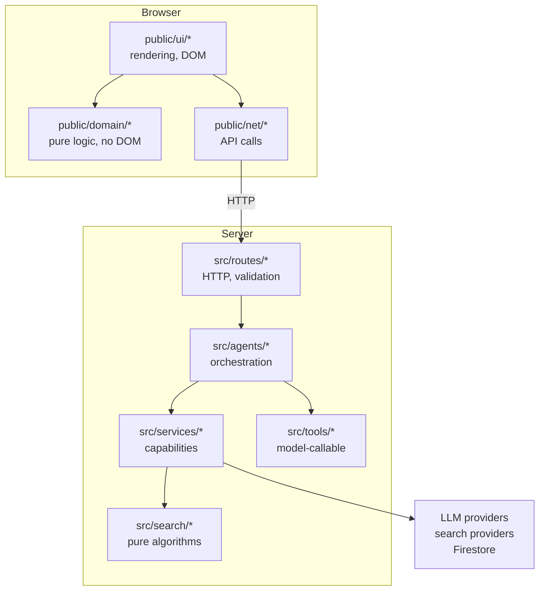

# Architecture

The target shape of this codebase, why it is that shape, and what is not
done yet. Written to be read before changing anything structural.

## Where it stands

Measured, not estimated:

| Area | State |
|---|---|
| `src/` backend | Service-oriented, no file over 1,111 lines. Healthy. |
| `public/app.js` | 6,760 lines, 240 top-level functions, one IIFE. The problem. |
| Worst function | `sendMessage`, 588 lines, cyclomatic complexity 126 |
| Tests | 236 browser assertions, 252 server assertions, all in CI |
| Build step | None, deliberately |

The backend does not need restructuring. Adding Clean Architecture
ceremony to a 776-line `server.js` would add layers without removing any
problem. The frontend is where the cost is, so that is where the work
goes.

## Layers


```mermaid
graph TD
    subgraph Browser
        UI[public/ui/*<br/>rendering, DOM]
        DOMAIN[public/domain/*<br/>pure logic, no DOM]
        NET[public/net/*<br/>API calls]
    end

    subgraph Server
        ROUTES[src/routes/*<br/>HTTP, validation]
        AGENTS[src/agents/*<br/>orchestration]
        SERVICES[src/services/*<br/>capabilities]
        TOOLS[src/tools/*<br/>model-callable]
        CORE[src/search/*<br/>pure algorithms]
    end

    PROVIDERS[LLM providers<br/>search providers<br/>Firestore]

    UI --> DOMAIN
    UI --> NET
    NET -->|HTTP| ROUTES
    ROUTES --> AGENTS
    AGENTS --> SERVICES
    AGENTS --> TOOLS
    SERVICES --> CORE
    SERVICES --> PROVIDERS
```

The rule that matters: **dependencies point inward and downward**. `domain`
never imports from `ui`. `search/searchCore` never imports a service. A
module that has no dependency on the DOM or the network is a module that
can be unit tested in milliseconds, and most bugs live in exactly that
kind of code.

## Directory layout

```
qjo-ai/
├── server.js                    Composition root: reads env, builds
│                                dependencies, injects them into routes.
│                                The only file that knows about process.env.
├── src/
│   ├── routes/                  HTTP boundary. Parse, validate, delegate,
│   │   ├── chat.js              serialise. No business logic.
│   │   ├── sse.js               Stream headers, keep-alives, cached replies
│   │   └── tasks.js
│   ├── agents/                  Orchestration: what to call, in what order,
│   │   ├── RoutingEngine.js     what to do when it fails.
│   │   ├── toolLoop.js          Tool rounds against the deadline; always ends in an answer
│   │   ├── toolAnswer.js        Evidence as data, synthesis prompt, sources-only fallback
│   │   ├── TaskRunner.js
│   │   └── taskStore.js         Storage port (Firestore | memory adapter)
│   ├── services/                One capability each, provider-facing.
│   │   ├── llmService.js        Providers, keys, rotation, cooldowns
│   │   ├── providerResponse.js  Reading a 200 body: SSE or JSON, under a timer
│   │   ├── searchService.js     Search providers, enrichment
│   │   ├── exportService.js     Export routes; PDF via Chromium (images guarded) or export/pdfFallback.js
│   │   ├── export/markdownModel.js  One reading of an answer's Markdown for every file
│   │   ├── export/docx.js       Word: headings, lists, tables, code, right to left
│   │   ├── export/xlsx.js       Excel: typed cells, frozen filtered header, totals
│   │   ├── export/pptx.js       Slides: a slide per section, tables and code paged, KPI and comparison layouts
│   │   ├── export/pdfFallback.js  PDF without Chromium: per-character fonts, right-to-left lines, tables, code
│   │   ├── export/fonts.js      Embedded Noto fonts (OFL) for both PDF engines
│   │   ├── exportService.js     PDF/DOCX/PPTX rendering
│   │   └── textSanitizer.js
│   ├── tools/                   Model-callable capabilities. Schema and
│   │   ├── toolRegistry.js      implementation declared together.
│   │   ├── searchTool.js
│   │   ├── fetchPageTool.js
│   │   └── workspaceTools.js
│   └── search/
│       ├── providers.js         Tavily, Serper, key-free fallbacks, per-provider health
│       └── searchCore.js        Pure: ranking, query distillation, scoring
├── public/
│   ├── index.html
│   ├── app.js                   Shell: state and wiring. Shrinking.
│   ├── lang-boot.js             Sets lang/dir before first paint
│   ├── domain/                  Pure functions. No DOM, no fetch, no state.
│   │   ├── language.js          Which language a text is in; which one the page opens in
│   │   ├── i18n.js              Every interface string, English and Arabic, same keys
│   │   ├── codeProject.js       Which code blocks make one preview; the document it runs
│   │   ├── siteRequest.js       Whether a message asks for a website (or a change to one)
│   │   ├── fileRequest.js       Whether an answer has a table, and whether a file was asked for
│   │   ├── markdown.js
│   │   ├── requestFailure.js    Error in, message and retry decision out
│   │   └── streamProtocol.js    SSE parsing, think-tag split, stall watchdog
│   ├── ui/                      Rendering and DOM behaviour
│   │   ├── sandbox.js           Runs generated JS/Python in an opaque-origin iframe's worker
│   │   ├── canvas.js            Code previews, inline and in the side studio; a tab, a download
│   │   ├── previewTab.js        A preview in a tab of its own (public/preview.html)
│   │   └── answerExports.js     Export buttons (Excel with a table) and the file card
│   └── net/                     API calls
├── scripts/                     Tests and checks, all runnable via npm
└── docs/
```

### Where new code goes

| Kind of code | Location | Test |
|---|---|---|
| Pure calculation, formatting, parsing | `public/domain/` or `src/search/` | Unit, no browser |
| Anything touching the DOM | `public/ui/` | Browser suite |
| An HTTP call | `public/net/` | Browser suite with routing |
| A capability the model can call | `src/tools/` | `scripts/test-*.js` |
| Provider integration | `src/services/` | Stubbed provider |
| Reading `process.env` | `server.js` only | — |

## Dependency injection

There is no container and there does not need to be one. Every module that
needs a collaborator takes it as an argument:

```js
const routingEngine = createRoutingEngine({ llmService, searchService, keys, models, extraTools });
const taskRunner = createTaskRunner({ store, llmService, searchService, keys, models });
registerChatRoutes(app, { verifyFirebaseRequest, routingEngine, cacheGet, cacheSet });
```

`server.js` is the only composition root. This is why the test suites can
run the real `RoutingEngine` against a scripted provider without a network,
and why `taskStore` swaps Firestore for memory by configuration rather than
by a flag inside the code.

`requireDeps()` at the top of each factory fails loudly at boot when a
dependency is missing, rather than at 3am inside a request handler.

## Quality gates

All wired into CI; all runnable locally.

| Command | What it holds |
|---|---|
| `npm run structure` | Per-file line budgets. A watched file may shrink, never grow. |
| `npm run typecheck` | JSDoc types checked by the TypeScript compiler. No build output. |
| `npm run lint` | Complexity ≤30, depth ≤5, params ≤6, plus correctness rules |
| `npm test` | Server behaviour, 34 assertions |
| `npm run test:search` | Search decision, results, budget |
| `npm run test:agent` | Tool loop bounds |
| `npm run test:tasks` | Task durability across restarts |
| `npm run test:fetch` | SSRF guards |
| `npm run test:resilience` | Key cooldowns, context recovery, trim budgets |
| `npm run test:stream` | Streaming integrity |
| `npm run test:routing` | Request classification |
| `npm run test:pdf` | Export rendering |
| `npm run scan-secrets` | No credentials in tracked files |

The structure and complexity budgets are ratchets set at what the code did
on the day they were added. Thresholds that fail immediately get disabled;
thresholds that start where you are get tightened.

## Security boundaries

| Surface | Protection |
|---|---|
| `fetch_page` opens model-chosen URLs | http/https only; private, loopback and link-local refused including `169.254.169.254`; DNS resolved and every resolved address checked; redirects followed manually with each hop re-validated; response streamed under a cap |
| Workspace file paths come from the model | Absolute paths, drive paths and traversal are validation errors; the workspace is an object in task state, never the filesystem |
| User JavaScript and Python execution | A worker inside an iframe sandboxed to `allow-scripts` only (`public/ui/sandbox.js`): origin `null`, so no access to the page, its storage or the signed-in session; a run past its limit ends the iframe; plot images accepted only as base64 |
| Images in an exported PDF | The document is the model's answer, printed by Chromium on the server: every request is intercepted; only inline data and images at public addresses load, each checked after DNS resolution and on every redirect by `fetch_page`'s guard |
| Code previews (HTML, React) | An iframe sandboxed to `codeProject.SANDBOX` (scripts, modals, forms, popups), never `allow-same-origin`, in the answer, the studio and a tab of its own; the document is built by `public/domain/codeProject.js`; file names the model chose are inserted as text. The tab (`public/preview.html`) shows only what the app window that opened it sends, from the app's origin |
| Answer HTML | Escaped before insertion; markdown rendering never emits raw user HTML |
| Provider keys | `server.js` only, never sent to the client; `scan-secrets` blocks commits |
| Task access | Every task route checks the caller owns the task |

## Languages

English is the primary language; Arabic is first-class.

- The page opens in the saved choice, else Arabic if the browser's first
  preference is Arabic, else English (`public/domain/language.js`). The
  direction is set before first paint by `lang-boot.js`.
- Every interface string lives in `public/domain/i18n.js` in both languages.
  The domain suite fails if the two catalogs differ in keys or placeholders,
  if English text contains Arabic, or if Arabic text was left in English.
- What the page answers itself, and what it sends the model, follows the
  language of the person's message, not the interface.
- The server prompt is English-first; the Arabic craft (`arabicPrompt.js`) is
  added whenever Arabic is in play. What does not depend on the message opens
  the request; what does travels with the newest message, which also says
  which language the person wrote in. `scripts/test-language.js` requires every
  Arabic phrase the prompt ever carried to still reach the model.
- The older browser suites run in an Arabic browser, keeping the Arabic
  interface under test; `language.test.js` covers English as primary.

## Failure handling

Each of these exists because it happened.

| Failure | Behaviour |
|---|---|
| Provider returns an empty answer | Treated as that provider failing; chain moves on |
| Prompt exceeds the context window | Halved keeping both ends, retried, model told content was removed |
| Context-length rejection | Not a key fault: no cooldown, no rotation |
| Search provider unreachable | Raced against a budget; snippets beat perfect results nobody receives |
| Search provider rejects the request (400/422) | Retried once with only the minimal documented parameters |
| Search provider out of credits or key rejected | Logged once a minute, rests 10 min (quota) or 30 min (key) instead of being asked every query; reason visible in `/api/status` → `searchHealth` |
| Every keyed search provider fails | Google News RSS, Wikipedia and DuckDuckGo run side by side, with time kept back for them |
| Every search source fails | An empty result marked `unavailable`, never an invented one; the model is told search is down, not that nothing exists; not cached |
| The model searches in another language than the question | Each result is judged against the query that found it as well as the question; ranking may prune, never empty, what the providers returned; the status is set after ranking |
| The model searches on its own (no Search toggle) | Its sources ride in `toolsUsed` to the page as source cards; kept through a continued answer; not stored in a long task's record |
| Answer cut off by token budget | Reported, with a continue action |
| A step of a long task fails | Task stays alive; stepping again resumes from that point |
| Render instance sleeps mid-task | State is in Firestore; the next step wakes it |
| Rendering error after an answer arrives | Costs that decoration only, never the answer |
| Provider sends headers, then nothing | The body is timed, not just the headers: before any output the call's deadline applies, after it a 15s silence ends the stream. A long answer that keeps arriving is never cut off |
| Every key of a provider stalls | One budget shared by all keys, not a fresh one each |
| A tool never returns | Raced against what is left of the deadline, one limit shared by every call in the round; the model is told it failed |
| A page opened by `fetch_page` sends headers, then stalls | One clock per hop covers the body too; the socket is released |
| A request over a provider's per-minute size (Groq 413, "Limit 8000, Requested …") | Sent again, on every call including rounds after a search, with the answer room the provider named — if at least 1,024 tokens remain; otherwise straight to the next provider |
| A provider slow to start on a long prompt | The wait for a first byte grows with the prompt (8 s + 2 s per 1K tokens, up to 30 s); a provider that stays silent is left after one wait — not each of its keys in turn, and not retried as a blip |
| A message that needs a specialised playbook (charts, cover letter, venting…) | The playbook, and its Arabic side when Arabic is in play, is chosen from the last two messages; everything else stays out of the prompt |
| A photo attached to be put somewhere ("put my photo in my CV and make a PDF") | No pixels go to a model: the page keeps the image under an id (`attachmentShelf.js`), the text model is told the id and how to place it (`attachmentRefs.js`), the page shows the image where the answer puts ``, and an export sends the images it refers to, checked on the server and drawn in the PDF and Word file (`export/attachedImages.js`). A question about an image still sends it to be looked at |
| A quiz the model wrote with its answer as a letter, an index or "B) …" | Read as the option it names (`public/domain/quiz.js`); an answer that names none is unknown, and the card then shows the choice and the explanation without judging either. The card's colours are the stylesheet's, per theme (`public/ui/quiz.js`) |
| Phone rules that repaint every word of an answer (mobile.css, styles.css) | Components with a palette of their own — the code block — are left out, inside `:where()` so the exclusion adds no specificity and outranks nothing; `readability.test.js` measures every piece of text in an answer against what is behind it, on phones and a desktop, in both themes |
| A file dropped on the page, or a screenshot pasted | Attached like one from the paperclip (`public/ui/composerDrop.js`); the browser is kept from opening a dropped file in the page's place. A paste that carries text stays text — cells copied from Excel come with a picture of themselves — unless the text is only the file's own name |
| Files from an answer | One labelled button, "Download as file", under every answer worth a file, and always shown under the newest one (older ones show their actions on hover); it opens a menu naming each format — Word, PDF, PowerPoint, and Excel when the answer has a table — kept whole on the screen, usable from the keyboard, closed once a format is chosen, saying so when the server could not make the file (`public/ui/answerExports.js`) |
| What to ask first | Eight groups of starters, each leading to a feature — files, study, research, code, a photo, charts, writing, plans (`public/ui/starters.js`; the words in `i18n.js`, one line per starter). Under the composer on a desktop, on the welcome screen on a phone. A starter that needs a file of yours (📎) opens the file picker; a starter is read like anything typed, so a file starter gets its file card (test-domain holds that) |
| The person stops an answer | The send button is Stop while an answer is written (`public/ui/sendStop.js`); what was written stays as the answer, with its actions and a line saying it was stopped, and the next request carries it. A stop before any text leaves nothing. The server does not cache an answer whose client went away (`chat.js`) |
| Speaking a message, hearing an answer | The browser's own speech recognition and voices (`public/ui/voiceInput.js`, `public/ui/answerReading.js`); no button where a browser has neither. Heard words go into the composer, never sent by themselves; an answer is read as its words — no code, addresses or citation numbers (`public/domain/speech.js`) — in its own language, in pieces Chrome will not cut off |
| Regenerate, Retry, Edit the last message | What leaves the conversation leaves the saved chat: every stored message knows its place (`seq`), and rewinding deletes from Firestore what it takes from the history, so the replacement is stored in the same place. A chat opened again shows what the screen showed. Edit (`public/ui/messageEditor.js`) is offered on the last message only, not on one that carried files |
| A PDF printed by Chromium | Sent as a Buffer (Puppeteer returns a Uint8Array, which Express would send as JSON); the page it prints has JavaScript off, and an image line's address is checked and escaped |
| A request that repeats most of the one before it | It opens exactly as that one did — the instructions, the person's settings, the tools, the conversation — and what was chosen for this message (playbooks, hints, the time) goes with the newest message, attached as it is sent (`promptLayout.js`); the page's window of earlier messages moves three turns at a time (`historyWindow.js`). Groq caches that shared opening and does not count it toward its limits; `/api/status` shows the share it counted as cached, per model |
| One Groq model's minute or day spent | That key rests for that model only, for as long as Groq said; Groq's other model answers before any other provider |
| Every key of a model resting for as long as the provider said | The call returns at once as rate-limited, without asking again |
| Every other slot refused or timed out | Groq's vision model (Qwen 3.8, with a minute of its own) is the last resort for text. It has 8K tokens a minute like the rest — Llama 4 Scout's 30K went with it in July 2026 — so a request too long for it is cut in the middle to fit (`providerLimits.cutToFit`): never the system prompt, and the model is told a part is missing |
| A model the provider has retired | Replaced by its successor before it is sent, and named as such in `/api/status` (`src/services/retiredModels.js`, applied in `server.js` and `llmService.js`): an old `GROQ_VISION_MODEL` naming Llama 4 Scout sent every picture to a model that no longer exists |
| A picture no model can see right now | The text models answer from what OCR read in it, sent without the picture they would refuse |
| What a message asks for | Judged on the person's own words (`public/domain/ownWords.js`), never on what the page attached to them: playbooks, the code overlay, the house guidance, the router's hint, the page's capsules, and whether a picture is an exercise. A CV's skills list chose every playbook, and one photo was over Groq's 8K a minute |
| Choosing the answer mode and the tools | One button switches Flash and Max with a tap and shows the one in use; one tools button opens Search or Deep search (one at a time) and Task, and names what is on (`public/ui/composerControls.js`). The same two buttons float above the composer on a phone. Neither changes while an answer is written |
| A Flash question that needs thought | A comparison, a "why", a plan, a riddle, sums or a long request (judged on the person's own words: `promptLayout.thinkingNeed`) keeps the model's default reasoning instead of low; the hardest — a riddle, several asks at once — go to the larger model first, even when the page named the fast one |
| A link or a form inside a code preview | A guard runs first in every preview (`codeProject.js`): a section link scrolls the page; another page of the answer is shown in its place (`canvas.js`), or a note says the answer has none; a link out opens a tab; a form is held with a note; localStorage, sessionStorage and cookies, which a sandbox without same-origin refuses, live in memory. Libraries from unpkg load as written (the CSP allows it); ES modules from CDNs it does not (skypack, esm.sh, unpkg's `?module`) and code.jquery.com come from jsdelivr |
| A website asked for | One HTML file for the preview (`public/domain/siteRequest.js`, also a change asked of the page the last answer was): the site playbook alone — no engineering overlay, bug-fix playbook, house guidance, calculator, router hint, tools or coding capsule; the larger model first, thinking lightly in Flash; 7,000 tokens of answer room (Groq's minute leaves about 3,900 of it after the request), and up to three continuations. `site-quality.test.js` holds a site to the playbook — no JS errors, nothing sideways at 360 px, every section link and image, content that appears, dark mode, a phone menu, axe — each check against a copy broken its way; `scripts/eval-sites.js` runs real answers through it when a key is set |
| A preview outside the answer | Under each page's preview and in the studio: open it in a tab of its own (`public/ui/previewTab.js`), which keeps it across a reload and shows the answer's other pages there; or download it as its file (`index.html`, `about.html`) — its styles and scripts in it, without the preview's guard. From the studio, what was edited there. A browser that blocks the tab is told so |
| An answer cut off inside its code | Carried on up to three times (`continuation.js`), each request with the instructions, the last request and the end of the answer only, so it fits a per-minute allowance. A block opened again and lines written twice are dropped before the page sees them; the page and the stored answer get the same text. Only a line of backticks alone closes a block, for the renderer and the stream reader alike |
| A file's text in a request | Each section once — a one-section file went as an overview and three copies — and not again beside the message that already carries it in the history; a retry sends the file again and saves it once |
| Every provider fails | The page says the AI services could not finish the request, with the reason — not that the server was asleep, not even while it retries quietly |
| The round after a search fails or stalls | Answer requested again without tools, the gathered results folded into the question, other providers first |
| No model can answer after a search | The sources themselves, with links, dates and what each says; never cached |
| The stream goes silent between server and page | Server sends a keep-alive every 10s; the page treats 45s of silence as a dropped connection — retried once if nothing arrived, kept and offered to continue if something did |
| An exception after the stream started | An `error` event, not a bare close |

## Not done yet

Honest list, in priority order.

1. `sendMessage` is down from 588 lines to ~320, complexity 126 to ~90;
   request building is the next piece to come out.
2. `public/app.js` still holds UI, network and state together. `domain/` and
   `ui/` extraction has started; `net/` has not.
3. `exportService.js` at 1,111 lines should split by output format.
4. No coverage measurement. The suites are thorough but unmeasured.
5. Type annotations cover new modules only.
